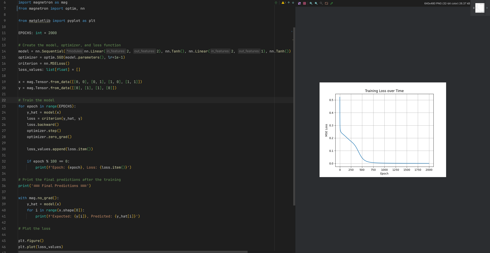

[![Contributors][contributors-shield]][contributors-url]
[![Forks][forks-shield]][forks-url]
[![Stargazers][stars-shield]][stars-url]
[![Issues][issues-shield]][issues-url]
[![MIT License][license-shield]][license-url]
[![LinkedIn][linkedin-shield]][linkedin-url]

 

  

<h3 align="center">magnetron</h3>
  

    Minimalistic homemade PyTorch alternative, written in C99 and Python.
     
    <a href="https://github.com/MarioSieg/magnetron"><strong>Explore the docs »</strong></a>
     
     
    <a href="https://github.com/MarioSieg/magnetron">View Demo</a>
    ·
    <a href="https://github.com/MarioSieg/magnetron/issues/new?labels=bug&template=bug-report---.md">Report Bug</a>
    ·
    <a href="https://github.com/MarioSieg/magnetron/issues/new?labels=enhancement&template=feature-request---.md">Request Feature</a>
  

  
Table of Contents

  <ol>
    <li>
      <a href="#about-the-project">About The Project</a>
    </li>
    <li>
      <a href="#getting-started">Getting Started</a>
      <ul>
        <li><a href="#prerequisites">Prerequisites</a></li>
        <li><a href="#installation">Installation</a></li>
      </ul>
    </li>
    <li><a href="#usage">Usage</a></li>
    <li><a href="#roadmap">Roadmap</a></li>
    <li><a href="#contributing">Contributing</a></li>
    <li><a href="#license">License</a></li>
    <li><a href="#contact">Contact</a></li>
    <li><a href="#acknowledgments">Acknowledgments</a></li>
  </ol>

## About The Project

This project started as a learning experience and a way to understand the inner workings of PyTorch and other deep learning frameworks. 
The goal is to create a minimalistic but still powerful deep learning framework that can be used for research and production. 
The project is written in C99 and Python, with the Python API being the main interface for the user. 
The project is still in its early stages and many features are missing, but the core functionality is already implemented. 

(<a href="#readme-top">back to top</a>)

<!-- GETTING STARTED -->
## Getting Started

To get a local copy up and running follow these simple steps.

### Prerequisites
* Linux, MacOS or Windows
* A C99 compiler (gcc, clang, msvc)
* Python 3.6 or higher

### Installation
*A pip installable package will be provided, as soon as all core features are implemented.*
1. Clone the repo
2. If you want to use the C library, use CMake to build the library and link it to your project.
3. If you want to use the Python API, enter the `python/magnetron_framework` directory within a VENV and run `install_wheel_local.sh` to build the wheel and install it locally.
4. Run the XOR example in the `python/examples/simple/xor.py` directory to test the installation.

(<a href="#readme-top">back to top</a>)

<!-- USAGE EXAMPLES -->
## Usage
See the `python/examples` directory for examples on how to use the framework.
For usage in C99 see the `test` directory in the root of the project.

(<a href="#readme-top">back to top</a>)

<!-- ROADMAP -->
## Roadmap

The goal is to implement training and inference for LLMs and other state of the art models, while providing a simple and small codebase that is easy to understand and modify.

- [X] 6 Dimensional, Linearized Tensors
- [X] Dynamic Computation Graph
- [X] Static Computation Graph
- [X] Modern Python API
- [X] CPU Compute and optimization
- [X] Compressed tensor file format
- [X] Validation and friendly error messages
- [X] Fast, custom memory allocators for CPU and GPU
- [X] Automatic differentiation
- [ ] Compute on GPU (Cuda)
- [ ] Other Datatypes (f16, bf16, int8)
- [ ] Multithreaded CPU Compute
- [ ] Distributed Training and Inference
- [ ] CPU and GPU kernel JIT compilation
- [ ] Better examples with real world models (LLMs and state of the art models)

(<a href="#readme-top">back to top</a>)

<!-- CONTRIBUTING -->
## Contributing

Contributions are what make the open source community such an amazing place to learn, inspire, and create. Any contributions you make are **greatly appreciated**.

If you have a suggestion that would make this better, please fork the repo and create a pull request. You can also simply open an issue with the tag "enhancement".
Don't forget to give the project a star! Thanks again!

1. Fork the Project
2. Create your Feature Branch (`git checkout -b feature/AmazingFeature`)
3. Commit your Changes (`git commit -m 'Add some AmazingFeature'`)
4. Push to the Branch (`git push origin feature/AmazingFeature`)
5. Open a Pull Request

(<a href="#readme-top">back to top</a>)

<!-- LICENSE -->
## License

Distributed under the Apache 2 License. See `LICENSE.txt` for more information.

(<a href="#readme-top">back to top</a>)

<!-- CONTACT -->
## Contact

Mario Sieg - [@_mario_neo_](https://twitter.com/_mario_neo_) - mario.sieg.64@gmail.com

Project Link: [https://github.com/MarioSieg/magnetron](https://github.com/MarioSieg/magnetron)

Developed 2024 in Berlin, Germany.

(<a href="#readme-top">back to top</a>)

<!-- SIMILAR PROJECTS -->
## Similar Projects

* [GGML](https://github.com/ggerganov/ggml)
* [TINYGRAD](https://github.com/tinygrad/tinygrad)
* [MICROGRAD](https://github.com/karpathy/micrograd)

(<a href="#readme-top">back to top</a>)

<!-- MARKDOWN LINKS & IMAGES -->
<!-- https://www.markdownguide.org/basic-syntax/#reference-style-links -->
[contributors-shield]: https://img.shields.io/github/contributors/MarioSieg/magnetron.svg?style=for-the-badge
[contributors-url]: https://github.com/MarioSieg/magnetron/graphs/contributors
[forks-shield]: https://img.shields.io/github/forks/MarioSieg/magnetron.svg?style=for-the-badge
[forks-url]: https://github.com/MarioSieg/magnetron/network/members
[stars-shield]: https://img.shields.io/github/stars/MarioSieg/magnetron.svg?style=for-the-badge
[stars-url]: https://github.com/MarioSieg/magnetron/stargazers
[issues-shield]: https://img.shields.io/github/issues/MarioSieg/magnetron.svg?style=for-the-badge
[issues-url]: https://github.com/MarioSieg/magnetron/issues
[license-shield]: https://img.shields.io/github/license/MarioSieg/magnetron.svg?style=for-the-badge
[license-url]: https://github.com/MarioSieg/magnetron/blob/master/LICENSE.txt
[linkedin-shield]: https://img.shields.io/badge/-LinkedIn-black.svg?style=for-the-badge&logo=linkedin&colorB=555
[linkedin-url]: https://linkedin.com/in/mario-sieg
[product-screenshot]: images/screenshot.png
[Next.js]: https://img.shields.io/badge/next.js-000000?style=for-the-badge&logo=nextdotjs&logoColor=white
[Next-url]: https://nextjs.org/
[React.js]: https://img.shields.io/badge/React-20232A?style=for-the-badge&logo=react&logoColor=61DAFB
[React-url]: https://reactjs.org/
[Vue.js]: https://img.shields.io/badge/Vue.js-35495E?style=for-the-badge&logo=vuedotjs&logoColor=4FC08D
[Vue-url]: https://vuejs.org/
[Angular.io]: https://img.shields.io/badge/Angular-DD0031?style=for-the-badge&logo=angular&logoColor=white
[Angular-url]: https://angular.io/
[Svelte.dev]: https://img.shields.io/badge/Svelte-4A4A55?style=for-the-badge&logo=svelte&logoColor=FF3E00
[Svelte-url]: https://svelte.dev/
[Laravel.com]: https://img.shields.io/badge/Laravel-FF2D20?style=for-the-badge&logo=laravel&logoColor=white
[Laravel-url]: https://laravel.com
[Bootstrap.com]: https://img.shields.io/badge/Bootstrap-563D7C?style=for-the-badge&logo=bootstrap&logoColor=white
[Bootstrap-url]: https://getbootstrap.com
[JQuery.com]: https://img.shields.io/badge/jQuery-0769AD?style=for-the-badge&logo=jquery&logoColor=white
[JQuery-url]: https://jquery.com 
